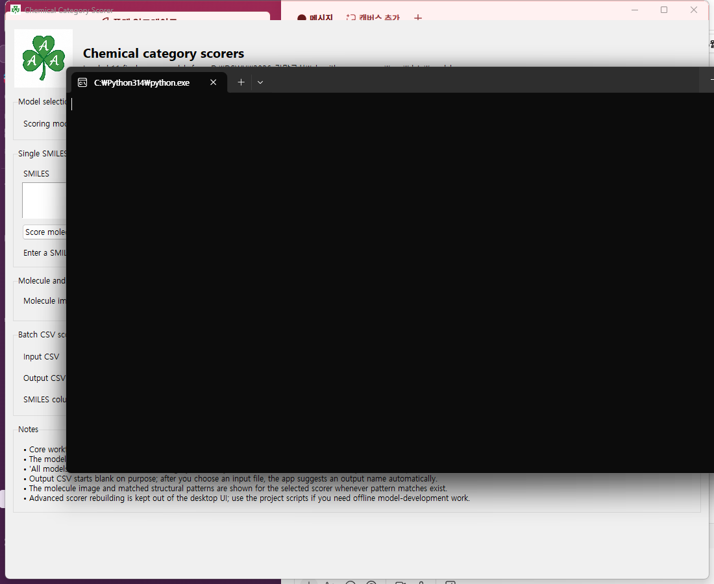

# Chemical Category Scorer

Local-first chemical product category scoring from molecular structure.

This repository ships the project in two delivery modes:

1. **Desktop app** for single-molecule and batch CSV scoring on a local workstation
2. **Python library** for direct import, similar to using an RDKit scoring helper

The local-first design matters for industrial chemistry use because molecular structures do not need to be uploaded to an external service.

## Desktop app



### Run from the repository

From the `app` directory:

```bat
run_desktop_app.bat
```

or:

```bash
python app/desktop_app.py
```

### Desktop app capabilities

- single-SMILES scoring
- batch CSV scoring
- local JSON-backed score models
- output without sending structures to a hosted API

## Python library

### Install from the public GitHub repository

```bash
pip install "chemical-category-scorer @ git+https://github.com/shkdidrlf/chemical-category-scorer.git"
```

### Install from a local clone

```bash
pip install .
```

### Python usage

```python
from rdkit import Chem
from chemical_category_scorer import pesticides, details_mol, available_models

mol = Chem.MolFromSmiles("ClC1=C(Cl)C(C#N)=C(Cl)C(C#N)=C1Cl")
score = pesticides(mol)
info = details_mol(mol, model_id="final_pesticides")
models = available_models()

print(score)
print(info.score, info.threshold, info.decision, info.matched_patterns)
print(models)
```

### Command-line entry points after installation

```bash
chemical-category-scorer --list-models
chemical-category-scorer --score "CCO" --model-id final_pesticides
chemical-category-scorer-desktop
```

## Final manuscript category set

- animal_drugs
- human_drugs
- cosmetics
- endocrine_disruptors
- flavoring_agents
- food_additives
- food_contact_substances
- fragrances
- pesticides
- solvents
- surfactants

## Repository contents

- `app/` desktop application and scoring engine
- `chemical_category_scorer/` importable Python API
- `paper/` manuscript draft and supporting tables
- `results/` final reporting outputs used in the manuscript

## Privacy

- no web upload is required for scoring
- inputs are read from local files only
- outputs are written to local files only
- model JSON files are bundled with the repository

## Manuscript note

The manuscript draft references this public repository as the source for the desktop app, Python package, and reproducibility materials.
